# Image Manipulation

All produced images are in the `images/` directory, and were committed alongside the project source.

## Running

Before running this project, make sure you have `rustc` version `1.58.0-nightly (c9c4b5d72 2021-11-17)` (this should be automatically enforced by `rust-toolchain.toml`). You can download `rustc` and `cargo` through [rustup](https://rustup.rs/) and upgrade to the latest rust version using either `rustup upgrade` or `rustup update` depending on your rustup version.

To run the project, make sure you are in the same current working directory as this README and type `cargo run --release`.

## Advanced exercise 1a

> Explain what the L, A and B channels are and what happens when you take away the L and A channels.

We're going to use the following image as a test image for all our examples:

By only taking the **L** channel, we can see that the image becomes grayscale. I believe that the **L** channel is the *lightness* channel.

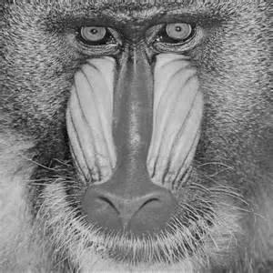

Taking any combination of the **A** and **B** channels without the **L** channel produces a black image, leading me to believe that the **A** and **B** channels describe color, and are therefore must have a non-zero lightness to produce any actual color.

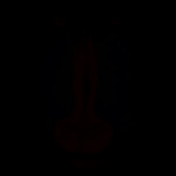

Taking **L** and **A** produces an image with only the aqua and pink colors showing:

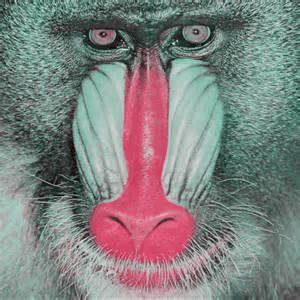

Taking **L** and **B** produces an image with only the brown and blue colors showing.

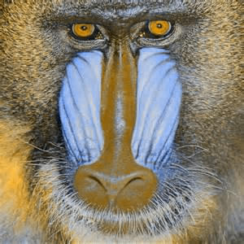

I don't think **A** and **B** stand for anything specific (or they stand for something so specific to color theory that I couldn't possibly know), but they seem to be axes describing a conceptual model of color perception where color can be divided into an aqua to pink spectrum and into a brown to blue spectrum. This image shows the entire spectrum using a **lightness** value of `50.0` (a middle value which provides the most actual "color range") and with the x-axis as A and the y-axis as B:

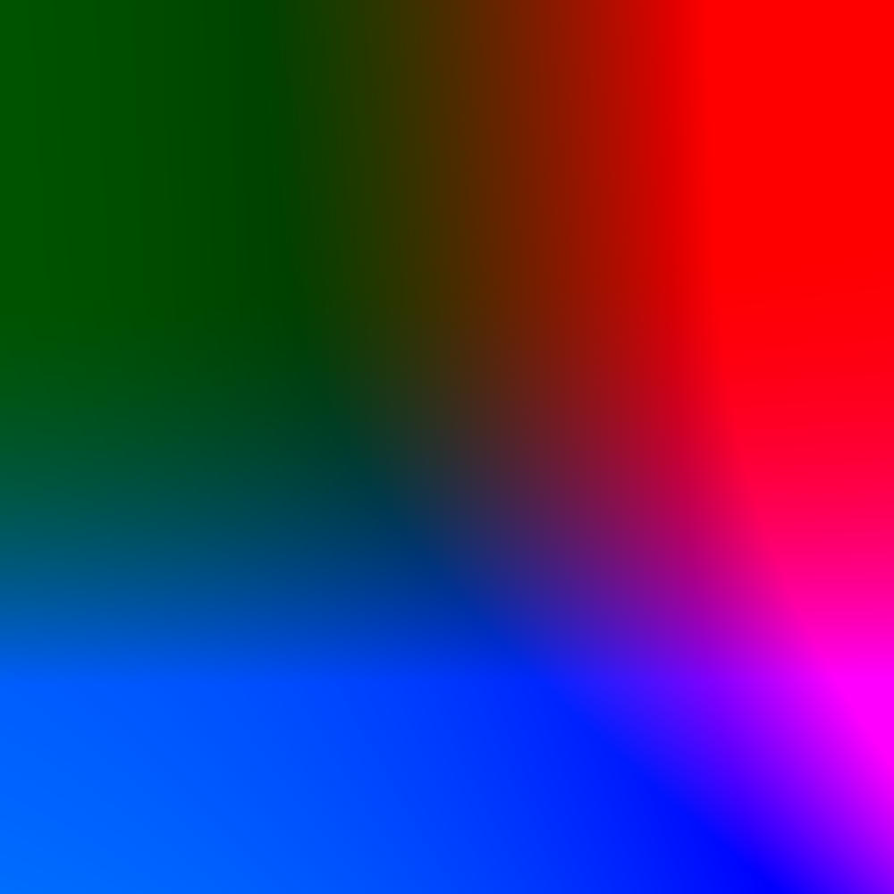

The ranges of these values are noteworthy, here. First, as hinted at above, the **lightness** component varies from `0` to `100`, even when represented as a float. More interestingly, unlike other color-spaces such as RGB and HSL, the A and B color components of LAB are technically unbounded and *signed*. While the most common values seem to be between `-150` and `150` (the value range used for the image above), they can get *much larger*. This, for instance, is the same "gamut" capped at `1000` in both the A and B directions:

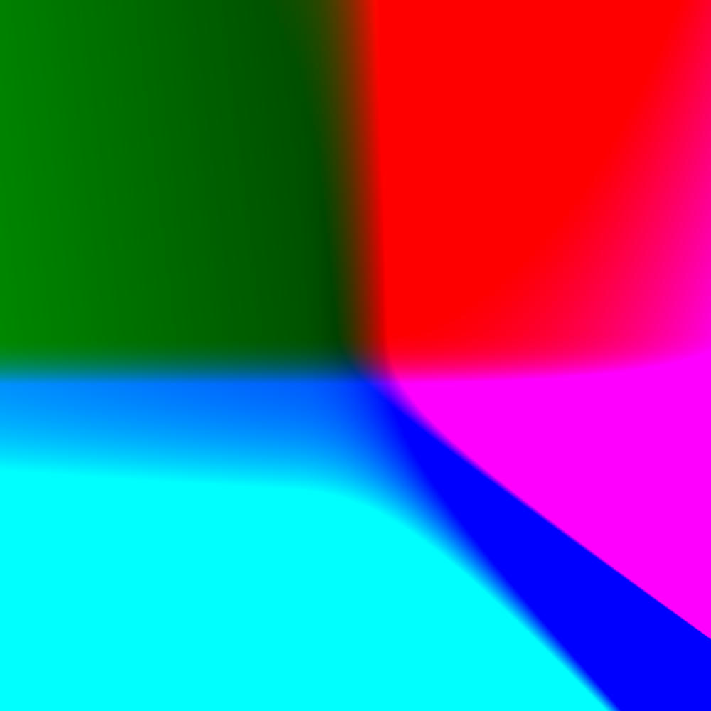

## Advanced exercise 2: HSV exploration

> Explain what the H, S and V channels are and what happens when you take away the both the H and S channels.
>
> It may help you to implement a function that performs HSV decomposition and removes these channels; this is optional.

HSV is a bit easier for me to explain. HSV stands for **hue**, **saturation**, **value**. Just like **LAB**, this colorspace splits colors up into a chromatic part (**HS**) and a brightness part (**V**) so all examples will have to preserve **V** lest we get entirely black images.

**Hue** describes a sort of primary color wheel (*i.e.* a color wheel with the most vibrant versions of a given "color"). **Saturation** defines how vibrant the colors are, with 0 being full grayscale and 1 being full hue. **Hues** are measured in degrees and are circular:

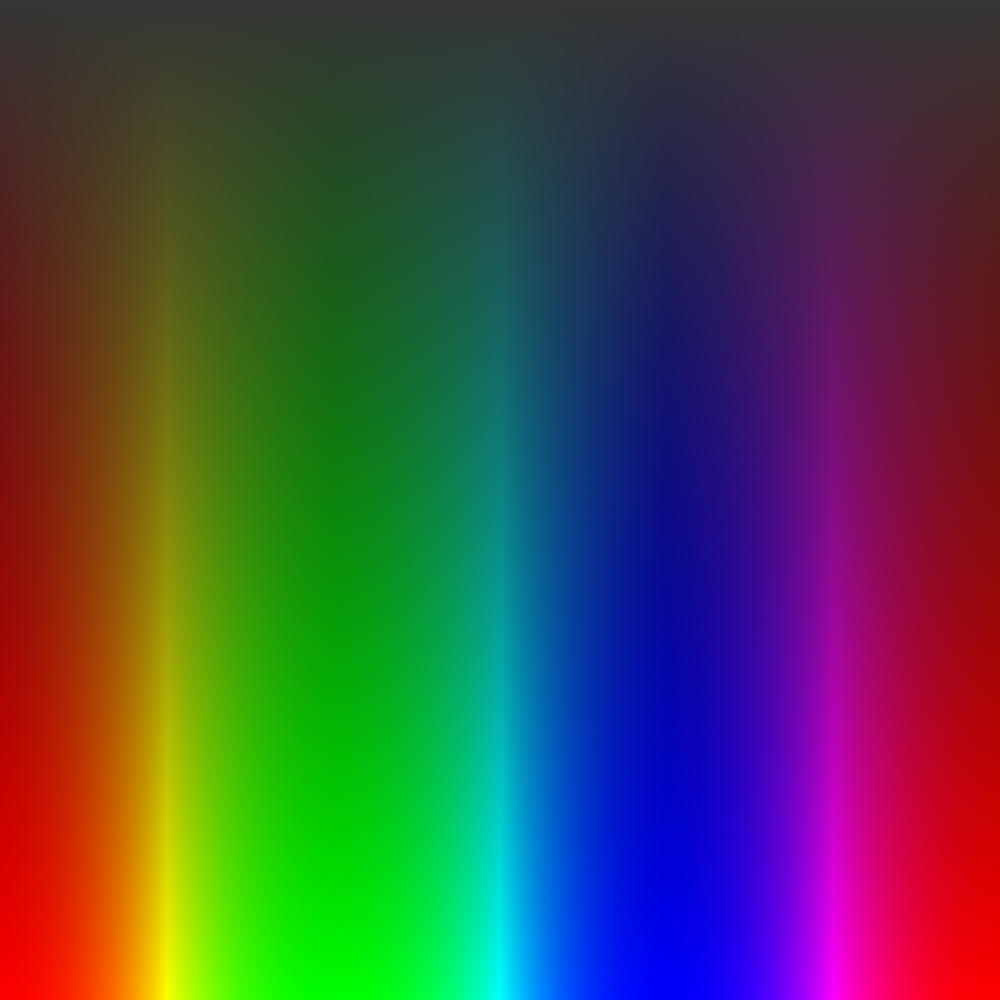

Taking only **hue** and **value** (setting saturation to zero), we get a grayscale image that is identical to an image with only the **value** channel preserved. This confirms our intuition that hue is unimportant when saturation is zero.

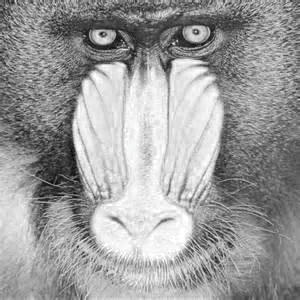

On the flip side, when we preserve **hue** and **value** but hold **saturation** at its full value, the image is very vibrant. However, there are noticeable artifacts. This is because hue becomes less tied to the ultimate RGB value of the pixels as saturation is lowered, making determining the actual hue for gray pixels from their RGB representation very difficult.

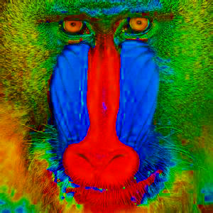

This can especially be seen when we perform this operation to a grayscale image. Because saturation is zero for all pixels, the detected hue defaults to zero. When we bump up this saturation, we get an image where the **hue** of all pixels is zero, giving the grayscale image a red appearance.

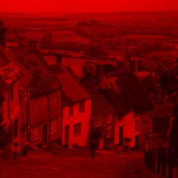

When we set **hue** to zero, keeping **saturation** and **value**, we get an image with various shades of red. This is because a hue of zero corresponds to red, effectively transforming all vibrant pixels into red.

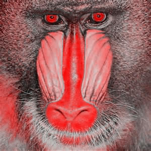
