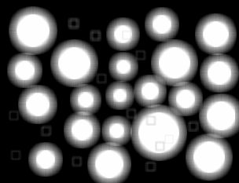

# Filters

All produced images are in the `images/` directory, and were committed alongside the project source.

## Running

Before running this project, make sure you have `rustc` version `1.58.0-nightly (c9c4b5d72 2021-11-17)` (this should be automatically enforced by `rust-toolchain.toml`). You can download `rustc` and `cargo` through [rustup](https://rustup.rs/) and upgrade to the latest rust version using either `rustup upgrade` or `rustup update` depending on your rustup version.

To run the project, make sure you are in the same current working directory as this README and type `cargo run --release`.

## Exercise 1

This first filter is a move filter. For every given pixel, it takes the pixel that is two pixels to the right of the kernel's center and uses that as the target pixel's brightness. Thus, this filter will translate the entire image two pixels to the left.
```rust
let filter1 = [
    [0,0,0,0,0],
    [0,0,0,0,0],
    [0,0,0,0,1],
    [0,0,0,0,0],
    [0,0,0,0,0]
];
```


This second filter is a brighten filter. For every given pixel, it takes the pixel at the kernel's center and scales each component by two. Thus, this filter will double the brightness of every pixel, with all brightnesses being clamped at `1.0`.

```rust
let filter2 = [
    [0,0,0],
    [0,2,0],
    [0,0,0],
];
```


This third filter is a sharpen filter. For every given pixel, the kernel takes 188% of the center pixel's value but subtracts 11% of the value of each 8 surrounding pixels.

```rust
let filter3 = [
    -0.11, -0.11, -0.11,
    -0.11,  1.88, -0.11,
    -0.11, -0.11, -0.11,
];
```


To better understand this filter's behavior, we can plot all combinations of the filter's input against the filter's output. There are two input variables here: the value of the center pixel and the aggregate value of the surrounding pixels. The value of each pixel is defined as just `1.88 * center - 8. * (0.11 * average surrounding)`.


**Note:** Red indicates negative values and blue indicates positive.

As we can see from this lovely MS-Paint plot, the resulting pixel is at its most extreme value when the brightness of the
interior pixel is maximally different to the brightness of the exterior pixel. When both pixels have the same value, the
pixel remains unchanged.

Thus, this filter exaggerates the differences between pixels (to the point where some pixel combinations will cause the
brightness to reach out-of-bounds and get clipped) making edges appear "sharper".

## Exercise 2

In the above examples, I applied the filters on each grayscale RGB plane independently.

Here's an example of a different filters being applied on each color plane independently, producing ~~what appears to be
an indie rock album cover~~ a very bad chromatic aberration shader.


## Exercise 3

In this exercise, I attempted to implement various types of blur filters. In particular, I wanted to compare the normal square blur filter which effectively takes the average of the surrounding area and a blur filter that only takes the average of the edge pixels. The square blur filter looks a bit like this:


Here's the original image:


Here's that image with square blur (and 11x11 filter):


And here it is with the "edge blur" filter (also 11x11):


This specific impact of the edge blur filter is not very clear (no pun intended) so let's try a different example.

Normal image:


Square blur (11x11):


Edge blur (11x11):



Now the difference is much clearer. In ignoring the center pixels, the inner part manifests itself only when the kernel
borders a blob (producing the aura-like artifacts around the big blobs) or when the kernel is fully engulfed in the blob
(hiding everything except the edges of the smaller blobs whose center is not big enough for the filter). Furthermore, the auras around the blobs have visibly distinct stages instead of a smooth transition to the center color as seen in the regular square blur example. This is because the black pixels mostly covering the filter are completely ignored when taking the average.

What a highly useful filter with many real world applications!

## Advanced exercise 1

Here, I'm comparing the behavior of the square blur algorithm when filtering with different edge handling techniques. Here are the results:

When using the zero-fill strategy, the edges of the image appear darker than the rest of the image because more and more of the kernel is registered as black as we approach them.


When using the wrap strategy, the edges don't lose brightness but can produce the occasional artifact if the pixels on either side of the image have a sudden contrast (see the yellow tinge on the bottom right side of the image?). 


Clamp works well enough for the monkey image as there are no sudden fades to unrelated colors.


However, this strategy can break down when the border pixels of an image are not representative of the rest of the border:


Notice here that there's a *very thin* black border around the image. This, however, is enough to produce an effect that is identical to the zero-fill strategy (try to guess which one's which):


This is fixed when we mirror instead of clamp the edge pixels. As you can see, the blur at the border is much more representative of the pixel contents near the image border:


And here's what it looks like for the monkey:


## Advanced Exercise 2

This exercise is much less relevant when working in compiled languages. The intended solution in Python, at least to my knowledge, is to outsource dot product computations to `numpy`. This is faster because it reduces interpreter overhead in the filter's tight inner loops by using a C implementation of the same function. However, this Rust program is already running natively and thus doesn't need the help of an external library to make computations run quicker.

Here are a few ways in which the algorithm could be further optimized, albeit with significant engineering efforts:

- Make the filter algorithm multi-threaded.
- Vectorize dot product computations.
- Improve the program's bandwidth by optimizing the image's layout so that the CPU doesn't have to keep several cache lines for each image row in the cache at the same time.
- Implement the algorithm on the GPU.
