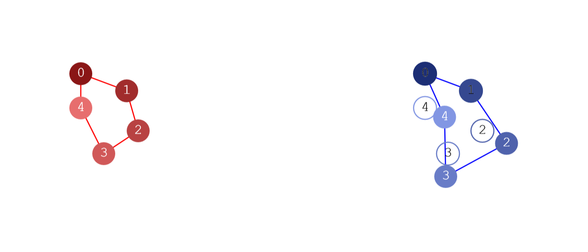
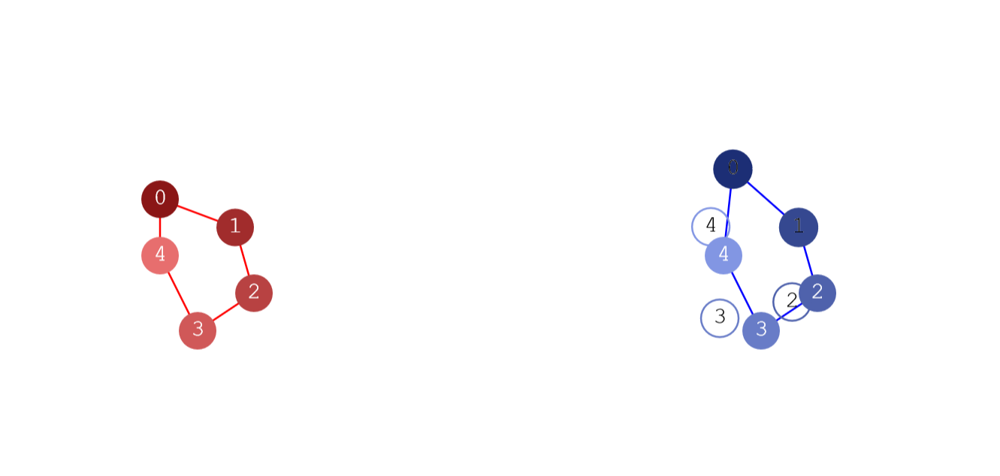
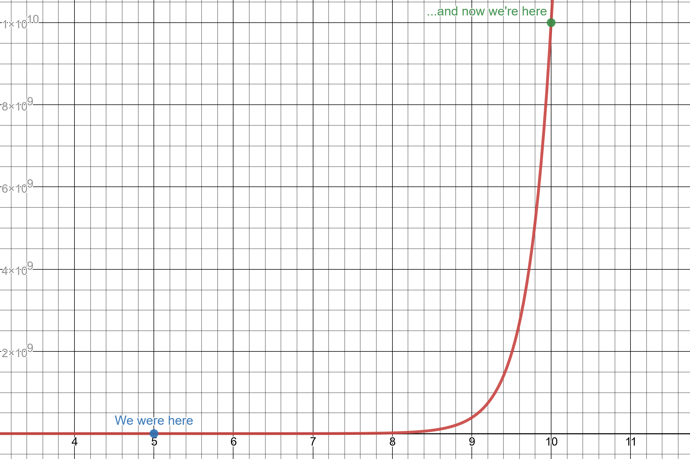

# Feature Detection

You can run the project by running `npm install` and `npm run start`. I'm running `node v16.3.0` and `npm v6.14.8`.

## Attempt 1

For this project, I decided to attempt to design my own naïve feature detection algorithm. The overall objective of this algorithm is to take in a list of vertices (e.g. image corners as detected by a corner detector) describing an object *template* and finding how closely it matches an unsorted list of vertices on the *target* image.

At its core, this algorithm goes through all permutations of the target vertex list in an attempt to find the best pairing of template to target nodes to minimize the error. While ideal pairing detection is an exponential algorithm (that is, `O(n)=n^n`), features are very simple and composable. Thus, while matching a 25 corner object will take forever with this algorithm, matching a 5 corner sub-feature and then composing the positions of each of those sub-features to describe the entire object is entirely reasonable.

The similarity score of the two meshes is determined to be the cumulative distance between the targets nodes and their corresponding template mesh *ghost* nodes after an arbitrary affine transformation (although handling flipping and skewing aren't as important right now). We use the first two nodes of the target chain to determine the scale and rotation of the mesh, meaning that the distance between the first two nodes to their ghost will always be zero. However, since we go through all permutations of the list ordering, every node should have a chance to be the first two "special" nodes. 

Enough theory, let's see how this works in practice:

Good, the ghost nodes don't move at all when we nudge target nodes 2, 3, and 4. Let's try nudging 0 and 1...

Wait what? The entire "ghost" mesh moved. Why didn't the algorithm chose a different pairing? Wouldn't an alternative permutation of the target nodes fix this though unless—*ah*. The problem is that we're *only permuting the target node list*, not the target *and* template lists. This means that node 0 and 1 on the template mesh will *always be* the first and second nodes of the template pairing. Thus, while we may have alternative nodes paired to template nodes 0 and 1, they will almost certainly not be selected by the permutation enumerator because *the order will be more wrong than the slightly-offset-but-relatively-true original pairing*. So special casing the first two nodes ends up being a problem. And it's not like we can just double the length of the list we're permuting to iterate through all these order permutations—exponential functions grow *very quickly*:

## Attempt 1.5

So if we can't fix the surrounding mesh transposition algorithm, why don't we combat the problem at its source and fix the chain comparison algorithm instead?

First, we can assume that the "center of mass" of the target meshes will be in more-or-less the same relative positions unless a node is *very far away* from its intended position. We can use the median distance from this origin to get a scaling factor. Finally, we can iterate through the target nodes to elect a node to be oriented along the same axis at the first node of the template mesh.

Now, the sole purpose of the exponential permutation enumerator is to find the ideal pairing between ghost nodes and their target nodes to minimize distance. So actually, for performance reasons, the algorithm is now reversed: we enumerate through every configuration of the ghost mesh and then calculate the best pairing between those ghost nodes and the target nodes to find the best-case error.

Because of time constraints, however, I was not able to implement this improvement.
