# Seam Carving

For this class' final exploration, I decided to implement [seam carving](https://en.wikipedia.org/wiki/Seam_carving), an image resizing technique where image seams with the "lowest value" are repeatedly removed from/added to the image to remove or stretch the least relevant details of the image.

This algorithm has many considerations and limitations that I attempt to address in my project writeup (this document) but before we get into those, here's a cat who has ~~seam~~ seen some things:

...and here are the project's build instructions:

## Build Instructions

Before running this project, make sure you have a minimum `rustc` version of `1.58.0 stable` (this should be automatically enforced by `Cargo.toml`). You can download `rustc` and `cargo` through [rustup](https://rustup.rs/) and upgrade to the latest rust version using either `rustup upgrade` or `rustup update` depending on your rustup version.

This application takes the form of a CLI tool. You can run this tool in any subdirectories of this root directory using `cargo run --release -- <args here>`. Specifying `--help` will bring up the application's help instructions.

## Determining Pixel Value

As hinted at above, seam carving works by iteratively removing seams with the "least cumulative value". As seen in the edge detection unit, humans rely more on the contour of objects than their actual contents to identify them. For example, you can still tell that this image is the same cat image as shown above:

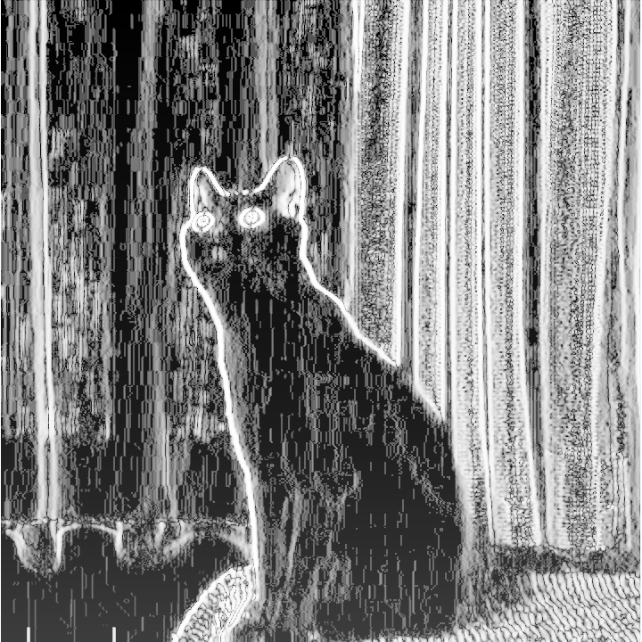

Thus, pixels which vary little from their surrounding neighbors are considered less valuable than major edge pixels. In other words, this algorithm prioritizes shape details over large swathes of unchanging scenery. Take this landscape for example:

Besides the edges between the sky and the clouds and the edges between the ground and the sky, there really aren't that many important details in the middle of the image and our sobel filter agrees:

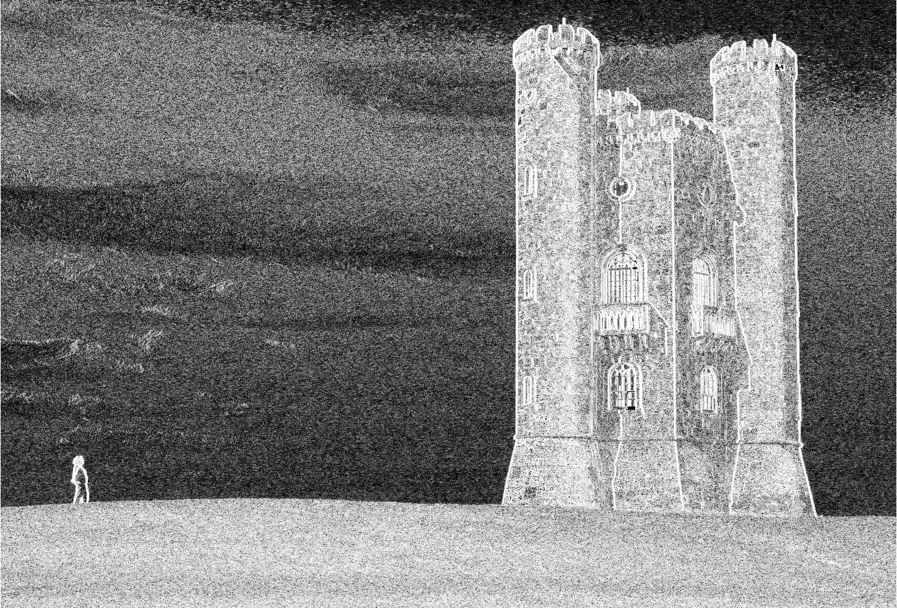

Note that the colors of this image aren't proportional to one another. Instead, we sort the pixels by their brightness and then use their indices to determine the brightness of the resulting pixel. So even though the cloud derivative may or may not be particularly high, they are *nothing* compared to the super high weights of the castle and will likely be removed before the seam carver ever begins to touch the castle. Our seam view confirms this intuition:

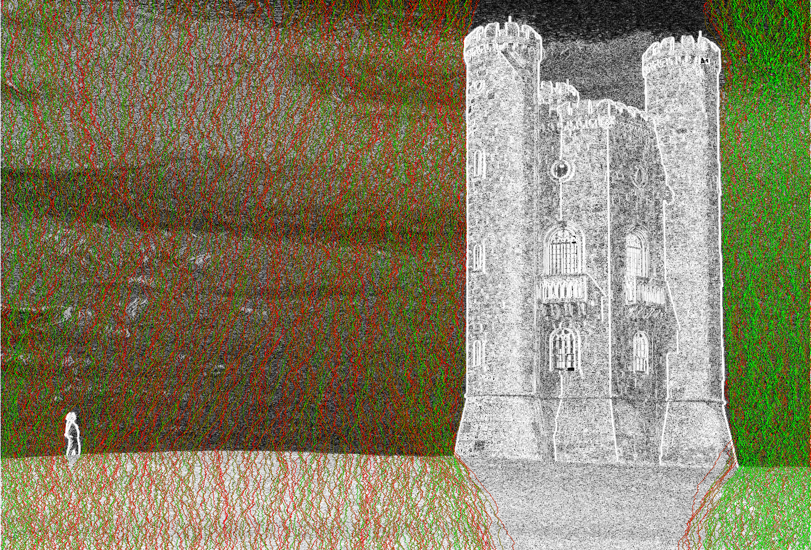

Not a single seam crosses through the castle or the person.

...and here's the final result:

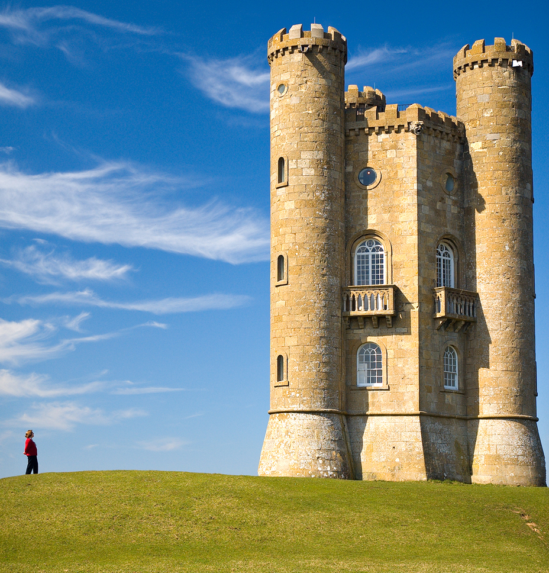

## Resisting Noise

Seam carving is surprisingly resilient. Noise is the typical archenemy of sobel filters because it introduces edges around each pixel grain which can be intuitively ignored by humans. However, because noise is typically distributed evenly throughout the image, their added pixel weight is uniform and will thus have a minimal impact the relative weights of the seams.

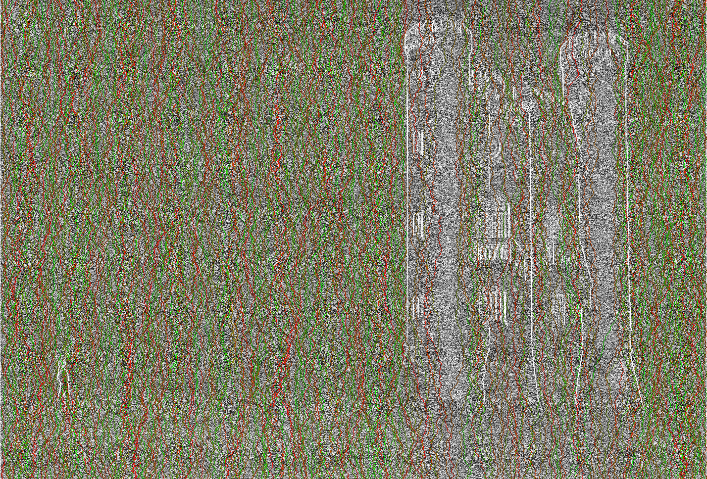

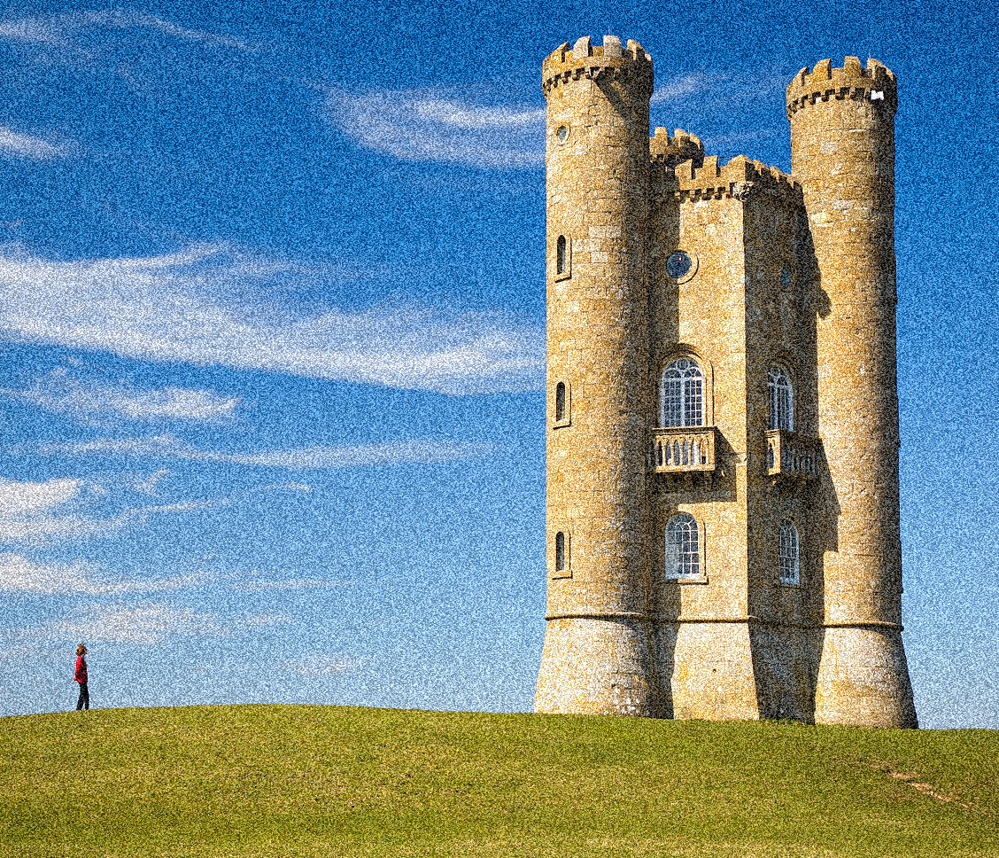

While fairly close to the original, this output is still visibly worse. Notice how a few seams are carved through the castle, which was previously untouched?

Looking at the sobel output of the filter, we can see that, while many of the large edges are preserved, the finer details are obscured by the noise grains such that they look almost identical to the flat sky regions of the image.

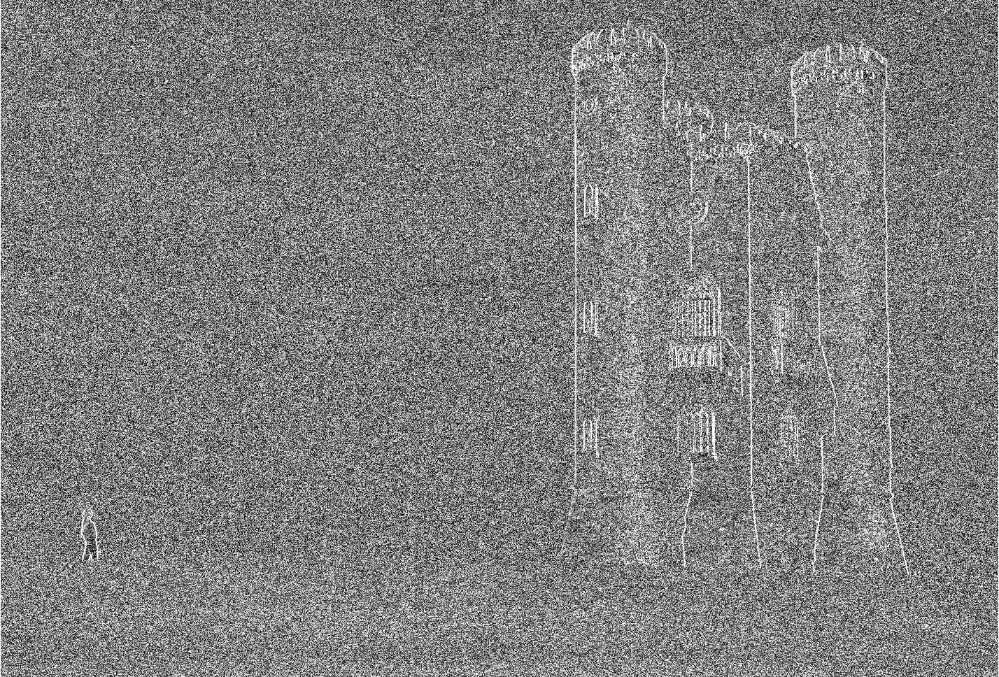

Notice how the "texture" of the castle are the sky are almost identical? Because of the noise grains, the sobel filter misses out on the windows, bricks, and other fine details which would otherwise make the castle more valuable than the sky. Compare that with the original sobel filter result:

Notice how a lot of the bricks visible in the original sobel filter result are entirely indiscernible in the noisy sobel filter result? 

> Again, note that the relative brightnesses of these two images is not all that relevant. The abrupt brightness jumps caused by the grains will naturally overpower the regular edges but because they are homogeneously spread, the castle is still relatively more valuable than the rest of the scenery.

Blurring typically fixes these sorts of problems but because the problem here is detail—not the noise grains—this probably won't work. Let's give it a shot anyways... 

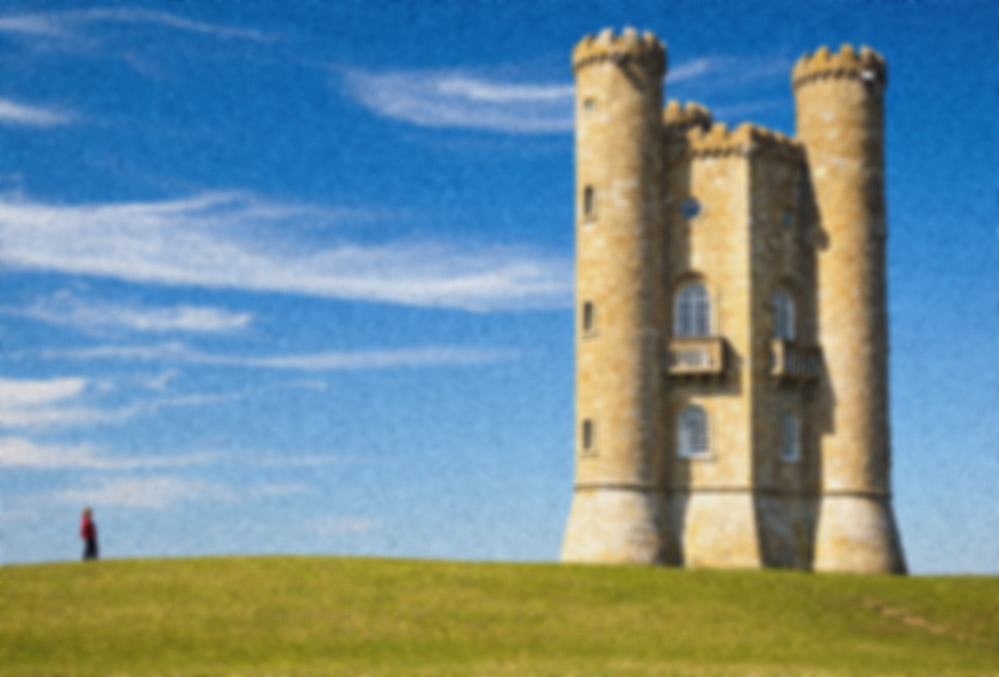

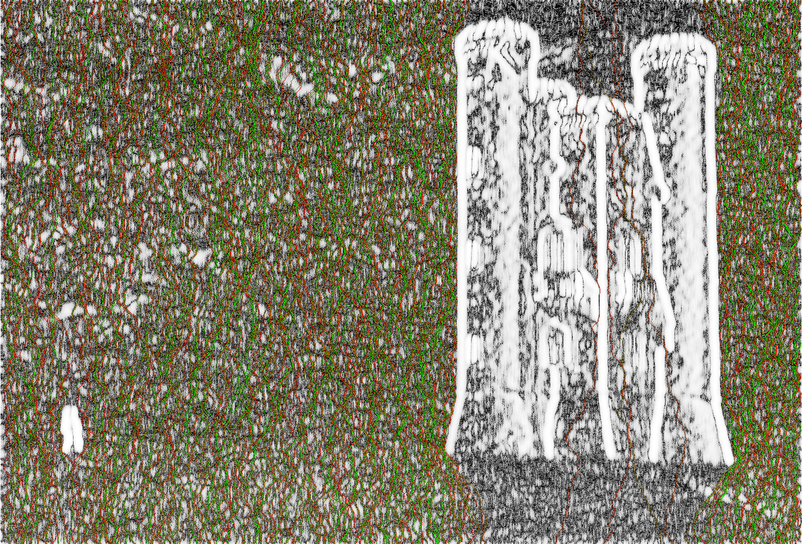

What? Why did that work so much better? Basically none of the seams cross through the castle anymore!

While this should have, in theory, produced results no better than before, it seems like more of the castle is considered significant. However, if we compare the sobel filter of the noisy castle and the blurry castle, we can see that the sobel filter doesn't pick up on new details that it missed before; rather, the strokes of the existing edges are simply thicker:

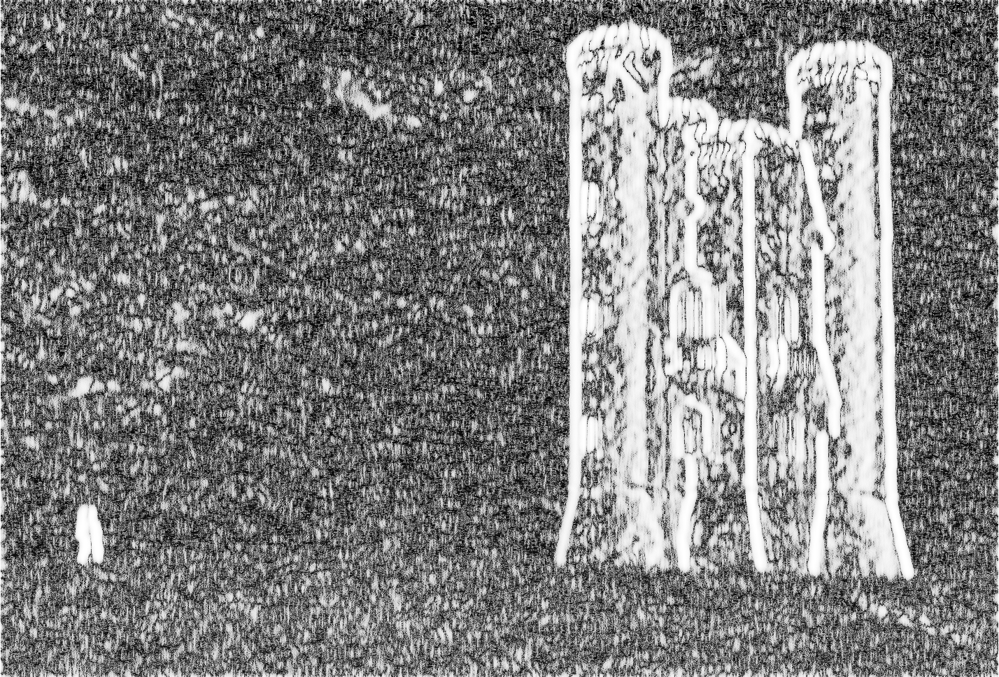

This is to be expected from the blur filter: all the edges are spread across more pixels. While this does reduce the average weight of each pixel, that doesn't matter when we only care about relative weights. Thus, local maxima are spread, resulting in the thick white lines around the previously *very thin* dominant pixels of the noisy image.

In increasing the thickness of these edges, the blur filter has effectively filled in all the gaps in the castle's main edges, preventing seams from going through it.

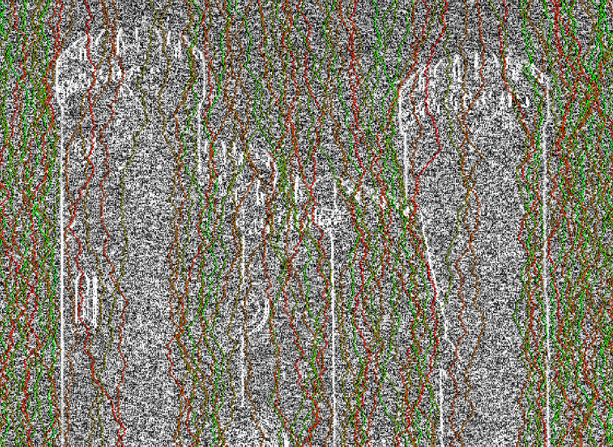

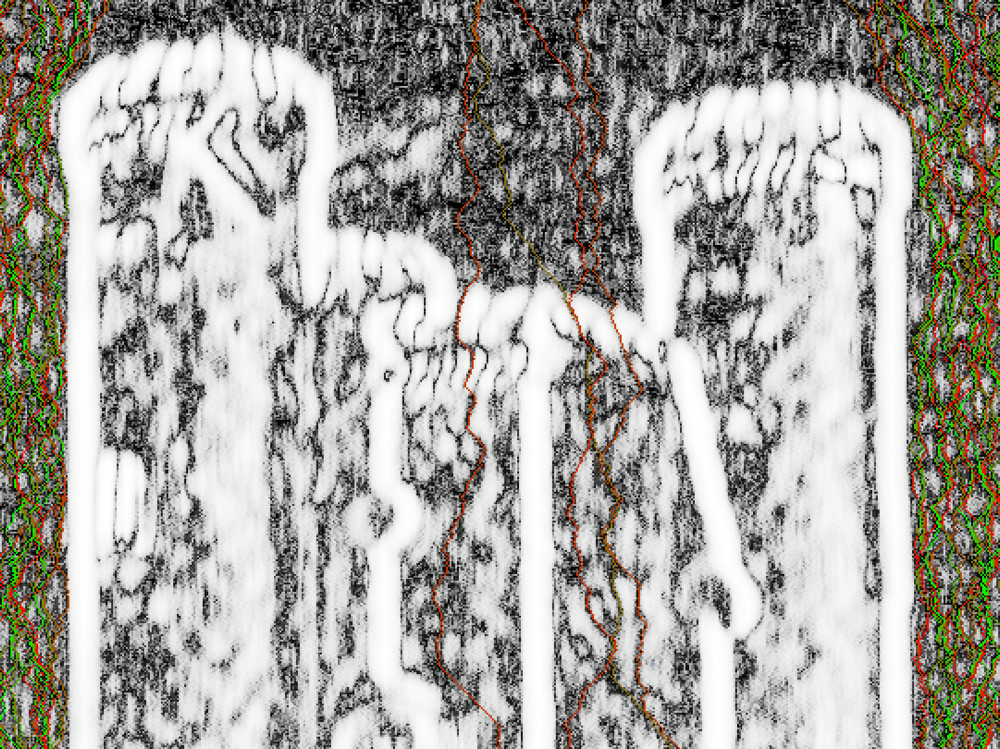

Because the weight representation and data representations of an image are separate in the seam carving pipeline, we blur the sobel filter independently of the original image data to carve better seams without also making the image blurry. Of course, this solution has the trade-off of being overly conservative with pixels near dominant edges, but that doesn't matter too much for this scene.

## Future Work

I didn't finish nearly as much as I wanted to with this implementation. I wanted to...

- [ ] Implement multi-axis resizing
- [ ] Implement no-copy carving with lazy weight updates
- [ ] Implement alternative weight computation techniques
- [ ] Implement image upsizing
- [ ] Implement custom region masking
- [ ] Implement a task system to reduce wasteful recalculations by the driver
- [ ] Implement a more dynamic carving visualization
- [ ] Make the CLI a bit more user-friendly
- [ ] Document incorrect sobel caching
- [ ] Document the various ways to handle multi-axis carving alternation
- [ ] Document image edge handling

## Image Sources

- `images/cat.png` is sourced from [this video](https://www.youtube.com/watch?v=EBF1o7ThQMc).
- `images/castle.jpg` (and its derivatives) are sourced from [this Wikimedia entry](https://commons.wikimedia.org/wiki/File:Broadway_tower.jpg).
