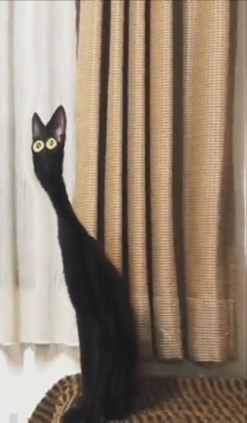

# Seam Carving

For this class' final exploration, I decided to implement [seam carving](https://en.wikipedia.org/wiki/Seam_carving), an image resizing technique where image seams with the lowest derivative are repeatedly removed/added to the image to remove the least relevant details in the image.

This algorithm has many considerations and limitations that I attempt to address in my project writeup (this document) but before we get into those, here's a cat:

...and here are the project's build instructions:

## Build Instructions

Before running this project, make sure you have a minimum `rustc` version of `1.58.0 stable` (this should be automatically enforced by `Cargo.toml`). You can download `rustc` and `cargo` through [rustup](https://rustup.rs/) and upgrade to the latest rust version using either `rustup upgrade` or `rustup update` depending on your rustup version.

This application takes the form of a CLI tool. You can run this tool in any subdirectories of this root directory using `cargo run --release -- <args here>`. Specifying `--help` will bring up the application's help instructions.

All examples are assumed to have a current-working-directory in the `images/` folder and a shell alias `carve <args here>` to `cargo run --release -- <args here>`.
